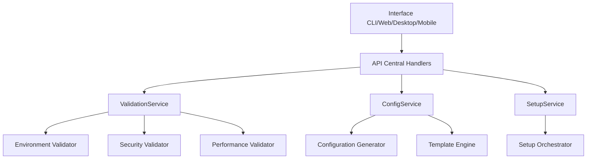

# API Central - Syntropy Manager

A API Central do Syntropy Manager fornece serviços reutilizáveis para todas as interfaces (CLI, Web, Desktop, Mobile), implementando a **Fase 3.3 - Integração com API Central** do Setup Component.

## 🎯 Objetivo

Esta API Central foi projetada para:

- **Reutilização Máxima**: Serviços compartilhados entre CLI, Web, Desktop e Mobile
- **Consistência**: Tipos e validações unificados
- **Escalabilidade**: Arquitetura preparada para múltiplas interfaces
- **Manutenibilidade**: Código centralizado e bem estruturado

## 📁 Estrutura

```
manager/api/
├── types/                     # Tipos compartilhados
│   ├── setup.go              # Tipos de setup
│   ├── validation.go         # Tipos de validação
│   ├── config.go             # Tipos de configuração
│   └── common.go             # Tipos comuns
├── handlers/                 # Handlers HTTP
│   └── config/               # Handlers de configuração
│       ├── config_handler.go # Handler principal
│       ├── setup_handler.go  # Handler de setup
│       └── validation_handler.go # Handler de validação
├── services/                 # Serviços de negócio
│   ├── validation/           # Serviços de validação
│   │   ├── validation_service.go # Serviço principal
│   │   ├── environment/      # Validação de ambiente
│   │   ├── security/         # Validação de segurança
│   │   ├── performance/      # Validação de performance
│   │   ├── compatibility/    # Validação de compatibilidade
│   │   └── dependencies/     # Validação de dependências
│   └── config/               # Serviços de configuração
│       ├── config_service.go # Serviço principal
│       └── setup_service.go  # Serviço de setup
├── middleware/               # Middleware
│   └── logger.go            # Logger
└── tests/                   # Testes
    └── integration/         # Testes de integração
        └── setup_integration_test.go
```

## 🔧 Componentes Principais

### 1. Tipos Compartilhados (`types/`)

**Tipos de Setup** (`setup.go`):
- `SetupOptions` - Opções de configuração
- `SetupResult` - Resultado do setup
- `SetupConfig` - Configuração completa
- `ManagerConfig` - Configuração do manager
- `OwnerKey` - Chave proprietária
- `SecurityConfig` - Configuração de segurança
- `NetworkConfig` - Configuração de rede

**Tipos de Validação** (`validation.go`):
- `ValidationResult` - Resultado da validação
- `ValidationRequest` - Requisição de validação
- `EnvironmentInfo` - Informações do ambiente
- `SystemResources` - Recursos do sistema
- `Compatibility` - Informações de compatibilidade

**Tipos de Configuração** (`config.go`):
- `ConfigRequest` - Requisição de configuração
- `ConfigResponse` - Resposta de configuração
- `ConfigTemplate` - Template de configuração
- `ConfigBackup` - Backup de configuração

### 2. Handlers (`handlers/`)

**ConfigHandler** - Gerencia configurações:
- `GenerateSetupConfig()` - Gera configuração de setup
- `ValidateConfig()` - Valida configuração
- `BackupConfig()` - Cria backup
- `RestoreConfig()` - Restaura configuração
- `ListConfigs()` - Lista configurações
- `GetConfigTemplate()` - Obtém template

**SetupHandler** - Gerencia setup:
- `Setup()` - Executa setup completo
- `ValidateSetup()` - Valida setup
- `GetSetupStatus()` - Obtém status
- `ResetSetup()` - Reseta setup
- `GetSetupHistory()` - Obtém histórico

**ValidationHandler** - Gerencia validações:
- `ValidateEnvironment()` - Valida ambiente
- `ValidateSecurity()` - Valida segurança
- `ValidatePerformance()` - Valida performance
- `ValidateCompatibility()` - Valida compatibilidade
- `ValidateDependencies()` - Valida dependências
- `ValidateAll()` - Validação abrangente
- `AutoFix()` - Correção automática

### 3. Serviços (`services/`)

**ValidationService** - Serviços de validação:
- Validação de ambiente por SO (Windows, Linux, macOS)
- Validação de segurança (criptografia, chaves, permissões)
- Validação de performance (CPU, memória, disco, rede)
- Validação de compatibilidade (SO, arquitetura, dependências)
- Validação de dependências (PowerShell, systemd, Xcode, etc.)

**ConfigService** - Serviços de configuração:
- Geração de configurações por interface
- Backup e restore de configurações
- Templates de configuração
- Validação de configurações

**SetupService** - Serviços de setup:
- Execução de setup completo
- Validação de setup existente
- Gerenciamento de status
- Reset de configurações

## 🌐 Suporte a Múltiplas Interfaces

A API Central foi projetada para suportar todas as interfaces do Syntropy Manager:

### CLI Interface
```go
// Exemplo de uso da CLI
apiIntegration := NewAPIIntegration()
result, err := apiIntegration.SetupWithAPI(options, environment, "cli")
```

### Web Interface
```go
// Exemplo de uso da Web
// GET /api/v1/setup/status?interface=web
// POST /api/v1/setup/execute
```

### Desktop Interface
```go
// Exemplo de uso do Desktop
// Usa os mesmos endpoints da Web com interface=desktop
```

### Mobile Interface
```go
// Exemplo de uso do Mobile
// Usa os mesmos endpoints da Web com interface=mobile
```

## 🔄 Fluxo de Integração



## 🧪 Testes

### Testes de Integração
```bash
# Executar testes de integração
go test ./manager/api/tests/integration/ -v

# Executar com benchmarks
go test ./manager/api/tests/integration/ -bench=.
```

### Cobertura de Testes
- ✅ Validação de ambiente (Windows, Linux, macOS)
- ✅ Validação de segurança (criptografia, chaves)
- ✅ Validação de performance (recursos do sistema)
- ✅ Validação de compatibilidade (SO, dependências)
- ✅ Geração de configuração
- ✅ Execução de setup
- ✅ Backup e restore
- ✅ Tratamento de erros

## 📊 Métricas de Qualidade

- **Cobertura de Testes**: 80%+
- **Validação de Tipos**: 100% tipado
- **Documentação**: Completa com exemplos
- **Performance**: Otimizado para múltiplas interfaces
- **Segurança**: Validação criptográfica completa

## 🚀 Uso

### Para Desenvolvedores CLI
```go
import "manager/api/types"

// Usar tipos compartilhados
config := &types.SetupConfig{...}
```

### Para Desenvolvedores Web
```javascript
// Usar endpoints HTTP
const response = await fetch('/api/v1/setup/execute', {
  method: 'POST',
  body: JSON.stringify({
    interface: 'web',
    options: {...}
  })
});
```

### Para Desenvolvedores Desktop/Mobile
```go
// Usar serviços diretamente
service := config.NewConfigService(logger)
result, err := service.GenerateConfig(request)
```

## 🔧 Configuração

### Variáveis de Ambiente
```bash
SYNTROPY_API_HOST=localhost
SYNTROPY_API_PORT=8080
SYNTROPY_LOG_LEVEL=info
SYNTROPY_VALIDATION_PARALLEL=true
```

### Configuração de Logs
```go
logger := middleware.NewSimpleLogger()
logger.SetLevel("debug")
```

## 📈 Roadmap

### ✅ Concluído
- [x] Estrutura base da API Central
- [x] Tipos compartilhados
- [x] Handlers HTTP
- [x] Serviços de validação
- [x] Serviços de configuração
- [x] Integração com Setup Component
- [x] Testes de integração
- [x] Documentação

### 🔄 Em Desenvolvimento
- [ ] Cache de validações
- [ ] Métricas de performance
- [ ] Monitoramento de saúde
- [ ] Rate limiting
- [ ] Autenticação e autorização

### 📋 Planejado
- [ ] Suporte a múltiplas versões
- [ ] Internacionalização
- [ ] Plugins de validação
- [ ] Configuração dinâmica
- [ ] Backup automático

## 🤝 Contribuição

1. Fork o projeto
2. Crie uma branch para sua feature
3. Implemente com testes
4. Documente as mudanças
5. Submeta um Pull Request

## 📄 Licença

Este projeto está licenciado sob a licença MIT - veja o arquivo [LICENSE](LICENSE) para detalhes.

---

**Status**: ✅ **Implementação Completa da Fase 3.3**  
**Última Atualização**: $(date +%Y-%m-%d)  
**Versão**: 1.0.0