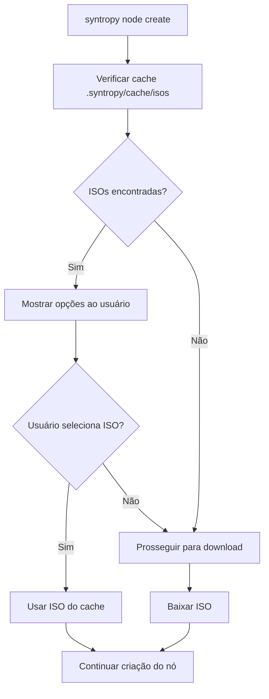

# Melhoria: Detecção Automática de ISOs em Cache

## Resumo

Esta melhoria implementa detecção automática de ISOs no diretório `.syntropy/cache/isos` durante o comando `syntropy node create`. O sistema agora:

1. **Detecta automaticamente** qualquer ISO válida no diretório de cache
2. **Lista opções** quando múltiplas ISOs estão disponíveis
3. **Permite seleção interativa** da ISO desejada
4. **Prossegue para download** apenas se necessário

## Funcionalidades Implementadas

### 1. Detecção Automática de ISOs

- O sistema verifica o diretório `~/.syntropy/cache/isos` antes de iniciar downloads
- Identifica automaticamente ISOs válidas baseado no nome do arquivo
- Valida integridade das ISOs usando SHA256

### 2. Seleção Interativa

#### Cenário 1: Uma ISO Disponível
```
📁 ISO encontrada no cache:
   Versão: 22.04 (solicitada: 24.04)
   Arquivo: ubuntu-22.04-live-server-amd64.iso
   Tamanho: 1.80 GB
   Data: 2024-01-15 14:30:25

❓ Deseja usar esta ISO? (s/n):
```

#### Cenário 2: Múltiplas ISOs Disponíveis
```
📁 Múltiplas ISOs encontradas no cache:

  1. Ubuntu 24.04 (versão solicitada)
     Arquivo: ubuntu-24.04-live-server-amd64.iso
     Tamanho: 1.90 GB
     Data: 2024-01-20 10:15:30

  2. Ubuntu 22.04
     Arquivo: ubuntu-22.04-live-server-amd64.iso
     Tamanho: 1.80 GB
     Data: 2024-01-15 14:30:25

  3. Baixar nova ISO (versão 24.04)

❓ Selecione uma opção (1-3):
```

### 3. Comando de Listagem

Novo comando para listar ISOs em cache:

```bash
syntropy node iso list-cache
```

Exemplo de saída:
```
🔍 Verificando ISOs em cache...

📁 Encontradas 2 ISO(s) no cache:

VERSÃO    ARQUIVO                              TAMANHO    DATA DE DOWNLOAD    STATUS
24.04     ubuntu-24.04-live-server-amd64.iso   1.90 GB    2024-01-20 10:15    ✅ Válida
22.04     ubuntu-22.04-live-server-amd64.iso   1.80 GB    2024-01-15 14:30    ✅ Válida

💡 Use 'syntropy node create' para usar uma dessas ISOs
💡 O sistema detectará automaticamente ISOs disponíveis
```

## Arquivos Modificados

### 1. `iso_downloader.go`

#### Novas Funções:
- `ListCachedISOs()` - Lista todas as ISOs válidas no cache
- `extractVersionFromFilename()` - Extrai versão do nome do arquivo
- `selectISOFromCache()` - Interface de seleção interativa

#### Função Modificada:
- `DownloadISOWithOptions()` - Agora verifica cache antes de baixar

### 2. `cli.go`

#### Novo Comando:
- `syntropy node iso list-cache` - Lista ISOs em cache

### 3. `iso_cache_test.go`

#### Testes Implementados:
- Teste de listagem de cache vazio
- Teste de extração de versão de nomes de arquivo
- Teste de seleção de ISO

## Fluxo de Execução



## Padrões de Nome de Arquivo Suportados

O sistema reconhece os seguintes padrões:
- `ubuntu-24.04-live-server-amd64.iso`
- `ubuntu-22.04-live-server-amd64.iso`
- `ubuntu-20.04-live-server-amd64.iso`
- `ubuntu-24.04.3-live-server-amd64.iso`

## Validação de Integridade

**Nota**: As validações de **SHA256 e tamanho** estão **desabilitadas por padrão** para permitir que o usuário selecione qualquer ISO encontrada no cache:
- Todas as ISOs encontradas no cache são listadas como opções
- O usuário pode escolher qualquer ISO, independente do checksum ou tamanho
- ISOs pequenas (ex: 35MB) são aceitas normalmente
- As validações podem ser reabilitadas em versões futuras como toggle

## Benefícios

1. **Economia de Tempo**: Evita downloads desnecessários
2. **Economia de Banda**: Reutiliza ISOs já baixadas
3. **Flexibilidade**: Permite usar diferentes versões disponíveis
4. **Conveniência**: Interface intuitiva para seleção
5. **Confiabilidade**: Validação automática de integridade

## Compatibilidade

- ✅ Mantém compatibilidade com versões anteriores
- ✅ Funciona com ISOs baixadas manualmente
- ✅ Suporta múltiplas versões do Ubuntu
- ✅ Interface em português conforme solicitado

## Exemplo de Uso

```bash
# Listar ISOs disponíveis
syntropy node iso list-cache

# Criar nó (sistema detectará ISOs automaticamente)
syntropy node create --ubuntu-version 24.04

# Criar nó forçando download (ignora cache)
syntropy node create --ubuntu-version 24.04 --skip-iso-download=false
```

## Testes

Execute os testes com:
```bash
go test ./src -v -run TestListCachedISOs
go test ./src -v -run TestExtractVersionFromFilename
go test ./src -v -run TestSelectISOFromCache
```
